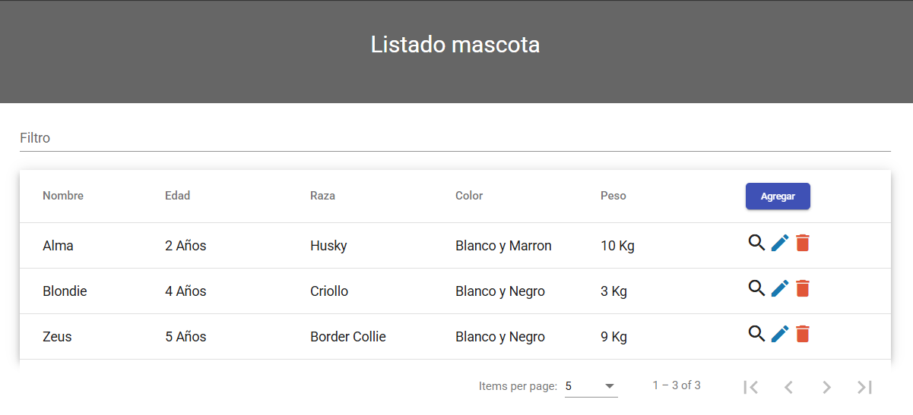
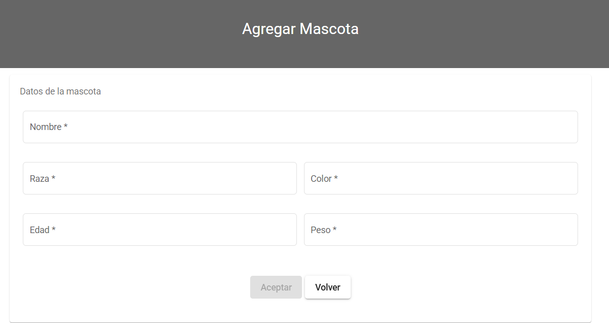

# 🐾 Pet Management System

A simple CRUD web application for managing pet data.  
Built with Angular (frontend) and .NET 6 (backend), using a REST API architecture.



## ✨ Features

- 📋 **Full CRUD** (Create, Read, Update, Delete)
- 🔍 **Search and pagination** on the pet list
- 📝 **Add/Edit pets** through a dedicated form
- 🔎 **View pet details** in a detail view page

### Pet data includes:

- Name
- Age
- Breed
- Color
- Weight

## ⚙️ Technologies Used

### Frontend

- **Angular 14**
- **Angular Material**
- **TypeScript**
- **RxJS**

### Backend

- **.NET 6**
- **ASP.NET Core Web API**
- **Entity Framework Core 6**
- **SQL Server**
- **AutoMapper**
- **Swagger (OpenAPI)**

## 📦 Main Dependencies

### Backend

- `Microsoft.EntityFrameworkCore 6.0.8`
- `Microsoft.EntityFrameworkCore.SqlServer 6.0.8`
- `AutoMapper.Extensions.Microsoft.DependencyInjection 12.0.0`
- `Swashbuckle.AspNetCore 6.2.3`

### Frontend

- `@angular/core 14.2.0`
- `@angular/material 14.2.6`
- `rxjs 7.5.x`

## 📸 Screenshots

### Pet List


### Add / Edit Pet Form



### Pet Details


## 🚀 How to Run the Project

### Backend

1. Clone the repository.
2. Navigate to the backend project folder.
3. Run the following command:
    ```bash
    dotnet run
    ```
4. The API will be available at `https://localhost:5001` or `http://localhost:5000`.

### Frontend

1. Navigate to the frontend project folder.
2. Install dependencies:
    ```bash
    npm install
    ```
3. Run the development server:
    ```bash
    npm start
    ```
4. The app will be available at `http://localhost:4200`.

## 🗂️ System Structure

- **Backend (API):** Provides endpoints for managing pets.
- **Frontend:** Consumes the API and displays the data in a user-friendly interface.

## 📝 Additional Notes

This project was developed as a personal practice to integrate an Angular frontend with a .NET 6 backend using a RESTful architecture.  
It demonstrates basic CRUD operations, form handling, pagination, and API consumption.

